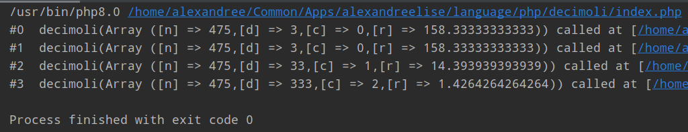

# Decimoli

>Decimal places patterns


<pre>

    __  __     ____         _____                              __                      __              
   / / / ___  / / ____     / ___/__  ______  ___  _____       / ____  ____  ____ ___  / ___  __________
  / /_/ / _ \/ / / __ \    \__ \/ / / / __ \/ _ \/ ___/  __  / / __ \/ __ \/ __ `__ \/ / _ \/ ___/ ___/
 / __  /  __/ / / /_/ /   ___/ / /_/ / /_/ /  __/ /     / /_/ / /_/ / /_/ / / / / / / /  __/ /  (__  ) 
/_/ /_/\___/_/_/\____/   /____/\__,_/ .___/\___/_/      \____/\____/\____/_/ /_/ /_/_/\___/_/  /____/  
                                   /_/                                                                 


</pre>

>   

---------------------------------------------

### Description:
Recursive function to compute patterns of decimal places when denominator is a repetition of 1 or more '3' and that the numerator is not divisible by the denominator. The decimal places "pattern" has as much digits than the denominator and repeats itself many times. I can't prove it yet but hopefully someone has already found this fun math puzzle

### Usage:

```shell

APP_NUMERATOR=475 /usr/bin/php8.0 index.php

```
You can choose the numerator you like. It must be a positive integer and
it must not be divisible by 3

--------------------------------------------

### Result:

Here the screenshot of the result:




--------------------------------------------
## INFOS

> English: [Click here to get in touch](https://github.com/mralexandrelise/mralexandrelise/blob/master/community.md "Get in touch")

> Français: [Cliquez ici pour me contacter](https://github.com/mralexandrelise/mralexandrelise/blob/master/community.md "Me contacter")
